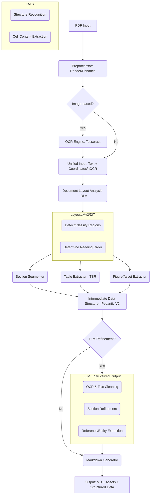

# pyScientificPdfParser: A Modular, AI-Powered Pipeline for Converting Scientific PDFs to Structured Markdown

**Gowtham Rao** <rao@ohdsi.org>

---

### Abstract

The proliferation of scientific literature in PDF format presents a significant challenge for automated data extraction and analysis. The complex, often multi-column layouts, embedded figures, and intricate tables are not easily parsed by traditional text extraction tools. This paper introduces `pyScientificPdfParser`, a novel open-source Python package designed to convert scientific PDF documents, including scanned images, into a structured, machine-readable GitHub Flavored Markdown (GFM) format. The system employs a modular, multi-stage pipeline architecture that integrates state-of-the-art (SOTA) technologies. Key components include Tesseract for Optical Character Recognition (OCR), deep learning-based Document Layout Analysis (DLA) using multi-modal transformers (e.g., LayoutLMv3, DiT), and specialized Table Structure Recognition (TSR) with models like TATR. A crucial feature is an optional Large Language Model (LLM) refinement module that leverages structured output techniques to correct OCR errors, improve section segmentation, and extract complex entities like citations. The package is designed for high modularity, robustness, and maintainability, with a strong emphasis on comprehensive testing and modern software engineering practices, aiming to provide a powerful tool for researchers and developers in the digital humanities and scientometrics fields.

---

### 1. Introduction

Scientific knowledge is predominantly archived and disseminated in the Portable Document Format (PDF). While ideal for human consumption and preserving visual fidelity, the format is notoriously difficult for machines to parse. The underlying structure of a scientific paper—its sections, reading order, tables, and figures—is often lost, especially in scanned documents or those with complex multi-column layouts. This "structure gap" hinders large-scale analysis, literature reviews, and the development of knowledge graphs.

Existing tools often struggle with one or more aspects of this problem. Simple text scrapers fail to understand reading order. OCR engines alone cannot differentiate a title from body text or a figure caption from a footnote. While some commercial solutions exist, there is a pressing need for a transparent, extensible, and powerful open-source tool that the research community can use, inspect, and build upon.

This paper presents `pyScientificPdfParser`, a Python package designed to meet this need. It orchestrates a pipeline of SOTA models to perform a deep semantic parsing of scientific documents. The system's core contribution is its hybrid approach, combining deterministic deep learning models for layout and table recognition with optional, LLM-powered modules for refinement and high-level structured data extraction. The final output is a clean, coherent Markdown file, making the scientific content accessible for further computational analysis, version control, or web publishing.

### 2. System Architecture and Methodology

The `pyScientificPdfParser` package is designed as a modular pipeline, allowing for flexibility and independent upgrades of its components. The process flows from initial PDF ingestion to final Markdown generation, with several key stages of analysis and refinement.

*Figure 1: The high-level processing pipeline of pyScientificPdfParser, from PDF input to structured Markdown output.*

#### 2.1. Input Preprocessing and OCR

The pipeline begins by ingesting PDF files. The system automatically detects whether pages contain embedded text or are purely image-based (e.g., from a scanner). For image-based pages, a preprocessing step using OpenCV is applied to enhance image quality through techniques like deskewing, denoising, and binarization.

Subsequently, the Tesseract OCR engine (v5+) is employed to extract textual content. Crucially, the system does not just extract raw text; it captures rich output formats (e.g., hOCR), which include the text, its bounding box coordinates, and confidence scores. This spatial information is vital for the subsequent layout analysis stage.

#### 2.2. Advanced Document Layout Analysis (DLA)

To understand the document's structure, we move beyond simple text extraction to DLA. This stage utilizes SOTA multi-modal transformer architectures, such as **LayoutLMv3** or the **Document Image Transformer (DiT)**, accessed via the Hugging Face `transformers` library. These models process both the textual information (from OCR) and the visual information (the page image) to classify distinct regions on the page.

The DLA model identifies and categorizes elements including:
- Title, Authors, and Abstract
- Section Headers (e.g., "1. Introduction")
- Body Text (in single or multiple columns)
- Tables and Figures
- Captions, Footnotes, and References

A key capability is the determination of the correct logical reading order, ensuring that text from a multi-column layout is re-flowed correctly into a single, linear sequence.

#### 2.3. Table Structure Recognition (TSR)

Once the DLA identifies a table region, a specialized TSR module is invoked. Scientific tables are often complex, containing spanning cells that merge multiple rows or columns. To accurately parse these, we employ dedicated deep learning models like the **Table Transformer (TATR)**. This model is specifically trained to recognize the detailed structure of a table, identifying rows, columns, and header cells, and correctly associating cell content with its structural position, even in the presence of spanning cells.

#### 2.4. Logical Section Segmentation

Using the identified section headers from the DLA stage, the system segments the document into a hierarchical structure corresponding to the standard IMRaD (Introduction, Methods, Results, and Discussion) format. The system is designed to be robust to common variations in section naming (e.g., "Methodology" vs. "Methods"). For ambiguous cases, sequence classification models (e.g., fine-tuned RoBERTa) or the LLM refinement module can be used to classify sections based on their content.

#### 2.5. LLM-Powered Refinement (Optional)

A key innovation of `pyScientificPdfParser` is its optional integration with Large Language Models (e.g., GPT-4o, Claude 3) for post-processing and refinement. To ensure reliability, all interactions with LLMs utilize structured output techniques (e.g., function calling, JSON mode) constrained by Pydantic V2 schemas. This forces the LLM to return data in a predictable, machine-readable format.

LLM-driven tasks include:
- **OCR Correction:** Correcting misrecognized words based on contextual understanding.
- **Text Flow Normalization:** Resolving hyphenated words that break across columns or pages.
- **Reference Parsing:** Transforming the unstructured "References" section into a list of structured BibTeX or JSON objects.
- **Entity Extraction:** Identifying and extracting specific entities like dataset names, funding sources, or DOIs from the text.

#### 2.6. Data Integrity and Output Generation

Throughout the entire pipeline, the document's structure is held in a robust internal representation managed by **Pydantic V2** data models. This ensures type safety and data integrity from initial extraction to final output.

The primary output is a **GitHub Flavored Markdown (GFM)** file. This format preserves the document's logical structure with appropriate heading levels, lists, and clean paragraphs. Tables are converted to GFM table syntax, and figures are extracted as image files (e.g., PNG) into an `assets` directory, with relative links embedded in the Markdown. Additionally, the package's Python API allows users to access the full structured data, including bounding boxes and element types, in a JSON format.

### 3. Implementation and Technology Stack

The package is built on a modern, open-source technology stack, chosen for performance and alignment with current research trends in Document AI.

- **Programming Language:** Python 3.10+
- **Deep Learning:** PyTorch
- **Model Hub:** Hugging Face `transformers`
- **OCR Engine:** Tesseract (v5+) via `pytesseract`
- **PDF Handling:** PyMuPDF (fitz)
- **Image Processing:** OpenCV, Pillow
- **Data Validation & LLM Integration:** Pydantic V2, `instructor`
- **Resilience:** `tenacity` for API call retries
- **Testing & Quality:** `pytest`, `mypy`, Black, `isort`, `flake8`

The architecture is explicitly modular, allowing, for example, the DLA model to be swapped out for a newer, better-performing one without requiring changes to the rest of the pipeline.

### 4. Quality Assurance and Robustness

A core principle of this project is to provide a high-quality, reliable tool. This is enforced through several non-functional requirements.

- **Comprehensive Testing:** The package maintains a target test coverage of over 95%, verified using `pytest` and `coverage.py`. The test suite includes unit tests for individual functions, integration tests for the full pipeline, and regression tests against a curated dataset of diverse scientific PDFs.
- **Continuous Integration (CI):** Every pull request automatically triggers a GitHub Actions workflow that runs linting (`flake8`), formatting (`black`), static type checking (`mypy --strict`), and the full test suite.
- **Code Quality:** The codebase strictly adheres to PEP 8 standards and enforces modern practices like full type hinting.
- **Resilience:** Interactions with external APIs (i.e., LLM providers) are wrapped in robustness patterns, including exponential backoff for retries and circuit breakers to handle transient service failures gracefully.
- **Caching:** The system implements optional caching of intermediate results (e.g., OCR or DLA output) to avoid redundant, time-consuming computations during batch processing or development.

### 5. Conclusion and Future Work

`pyScientificPdfParser` provides a robust, open-source solution for a long-standing challenge in scientific data processing. By integrating SOTA deep learning models for layout and table analysis with optional LLM-based refinement, it achieves a level of parsing accuracy and structural understanding previously unavailable in open-source tools. Its modular architecture and commitment to software quality ensure that it can serve as a dependable foundation for a wide range of applications in scientometrics, research synthesis, and knowledge base construction.

Future work will focus on expanding the parser's capabilities to include areas intentionally left out of the initial scope. The most prominent next steps are the parsing of complex mathematical equations into LaTeX or MathML and exploring higher-level semantic tasks, such as document summarization or comparison, building upon the structured output generated by the current pipeline.

### 6. References

1.  Li, Y., et al. (2022). *LayoutLMv3: Pre-training for Document AI with Unified Text and Image Masking*. arXiv preprint arXiv:2204.08387.
2.  Smock, B., Pesala, R., & Abraham, R. (2022). *PubTables-1M: Towards Comprehensive Table Extraction From Unstructured Documents*. Proceedings of the IEEE/CVF Conference on Computer Vision and Pattern Recognition (CVPR).
3.  He, K., et al. (2022). *Masked Autoencoders Are Scalable Vision Learners*. arXiv preprint arXiv:2111.06377. (Related to DiT architecture).
4.  Smith, R. (2007). *An Overview of the Tesseract OCR Engine*. Proceedings of the Ninth International Conference on Document Analysis and Recognition (ICDAR).
5.  Pydantic Team. (2023). *Pydantic V2 Documentation*. https://docs.pydantic.dev/latest/
6.  Liu, J. (2023). *Instructor: Structured outputs for LLMs*. GitHub. https://github.com/jxnl/instructor
